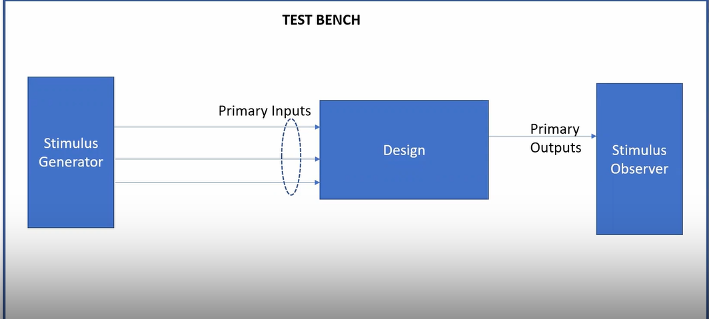
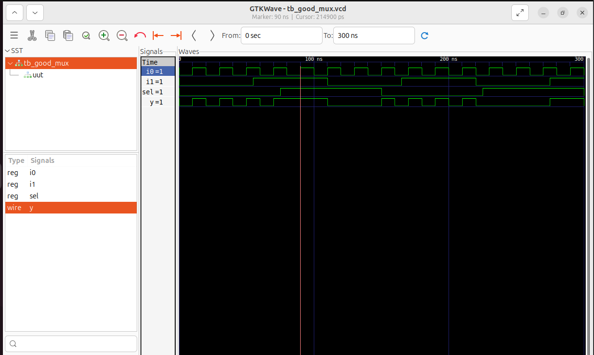

# **Introduction to iVerilog, Design and Test Bench**

## 1. What is Simulator, Design & Test Becnch?

### Simulator:
A simulator is a software tool that models the behavior of a digital circuit described in HDL (Hardware Description Language) like Verilog or VHDL, and allows designers to verify if the logic works as intended.

### Design:
The design is the Verilog code (or group of Verilog files) that captures the intended behavior of the digital system, created to fulfill the defined requirements.

### TestBench:
A testbench in Verilog is a simulation environment used to verify the correctness of a digital design (also called the DUT – Design Under Test).
The main goal of a testbench is to stimulate the design and observe its output.
Unlike the actual design code, a testbench:

- Is not synthesized (i.e., it will never become hardware)

- Is only used for simulation and verification
  


## 2. iVerilog:

- iVerilog is a free, open-source tool used to simulate Verilog code.
- You provide both your design code and testbench to Iverilog as inputs.
- iVerilog compiles these files and performs the simulation.
- The simulator outputs a .vcd(Value Change Dump) file that records signal value changes during simulation.
- This .vcd file can be viewed using GTKWave to analyze waveform behavior.
- Using this simulation flow, you can check and debug your design’s functionality before actual hardware implementation.

  

## 3. Lab- Simulating a 2x1 Multiplexer:

### Step-1: Clone the Workshop Repository
```
git clone https://github.com/kunalg123/sky130RTLDesignAndSynthesisWorkshop.git
cd sky130RTLDesignAndSynthesisWorkshop/verilog_files
```
### Step-2: Checking for the required tools to Simulate:
```
- iverilog
- gtkwave
```
### Step-3: Simulate the design:
Compile the 2x1 Multiplexer design and testbench
```
iverilog good_mux.v tb_good_mux.v
```
Run the Simulation
```
./a.out
```
View waveform in gtkwave:
```
gtkwave tb_good_mux.vcd
```


### Step-4: Verilog code Analysis:
Design Code for the 2x1 MUX (good_mux.v)
```
module good_mux (input i0, input i1, input sel, output reg y);
always @ (*)
begin
    if(sel)
        y <= i1;
    else 
        y <= i0;
end
endmodule
```
Testbench Code for 2x1 MUX (tb_good_mux.v)
```
`timescale 1ns/1ps
module tb_good_mux;
    reg i0,i1,sel; //inputs
    wire y; //outputs
    //instantiate the uut(unit under test)
    good_mux_uut(
            .sel(sel),
            .i0(i0),
            .i1(i1),
            .y(y)
    );
    initial begin
    $dumpfile("tb_good_mux.vcd");
    $dumpvars(0,tb_good_mux);
    //initialize the inputs
    sel=0;
    i0=0;
    i1=0;
    #150 $finish;
    end
always #50 sel=~sel;
always #10 i0=~i0;
always #55 i1=~i1;
endmodule

```
### Working of 2x1 MUX:
- Inputs: i0, i1 (data), sel (select line)
- Output: y (registered output)
- Logic: If sel is 1, y gets i1; if sel is 0, y gets i0.


