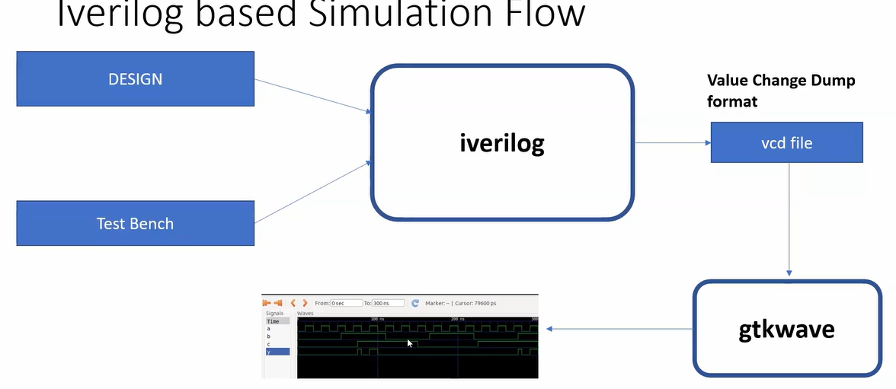
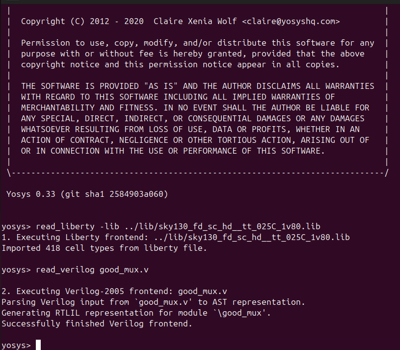
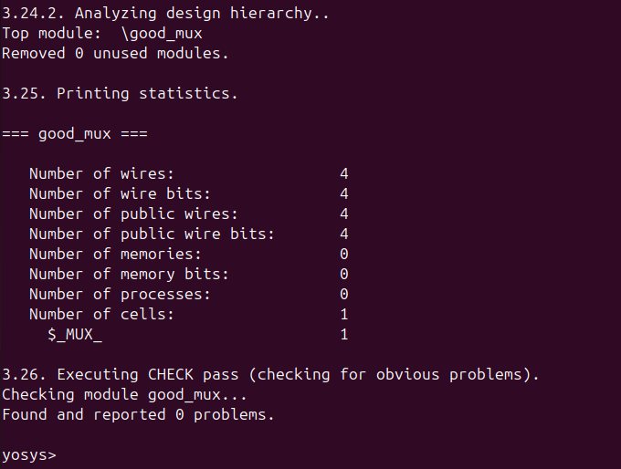
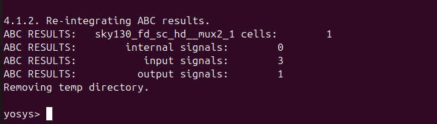
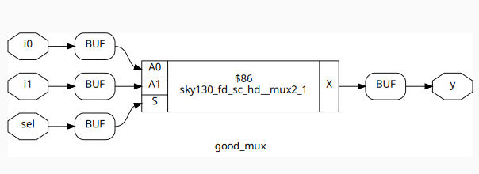

# **Introduction to iVerilog, Design and Test Bench**

## 1. What is Simulator, Design & Test Becnch?

### Simulator:
A simulator is a software tool that models the behavior of a digital circuit described in HDL (Hardware Description Language) like Verilog or VHDL, and allows designers to verify if the logic works as intended.

### Design:
The design is the Verilog code (or group of Verilog files) that captures the intended behavior of the digital system, created to fulfill the defined requirements.

### TestBench:
A testbench in Verilog is a simulation environment used to verify the correctness of a digital design (also called the DUT – Design Under Test).
The main goal of a testbench is to stimulate the design and observe its output.
Unlike the actual design code, a testbench:

- Is not synthesized (i.e., it will never become hardware)

- Is only used for simulation and verification
  


## 2. iVerilog:

- iVerilog is a free, open-source tool used to simulate Verilog code.
- You provide both your design code and testbench to Iverilog as inputs.
- iVerilog compiles these files and performs the simulation.
- The simulator outputs a .vcd(Value Change Dump) file that records signal value changes during simulation.
- This .vcd file can be viewed using GTKWave to analyze waveform behavior.
- Using this simulation flow, you can check and debug your design’s functionality before actual hardware implementation.

  

## 3. Lab- Simulating a 2x1 Multiplexer:

### Step-1: Clone the Workshop Repository
```
git clone https://github.com/kunalg123/sky130RTLDesignAndSynthesisWorkshop.git
cd sky130RTLDesignAndSynthesisWorkshop/verilog_files
```
### Step-2: Checking for the required tools to Simulate:
```
- iverilog
- gtkwave
```
### Step-3: Simulate the design:
Compile the 2x1 Multiplexer design and testbench
```
iverilog good_mux.v tb_good_mux.v
```
Run the Simulation
```
./a.out
```
View waveform in gtkwave:
```
gtkwave tb_good_mux.vcd
```


### Step-4: Verilog code Analysis:
Design Code for the 2x1 MUX (good_mux.v)
```
module good_mux (input i0, input i1, input sel, output reg y);
always @ (*)
begin
    if(sel)
        y <= i1;
    else 
        y <= i0;
end
endmodule
```
Testbench Code for 2x1 MUX (tb_good_mux.v)
```
`timescale 1ns/1ps
module tb_good_mux;
    reg i0,i1,sel; //inputs
    wire y; //outputs
    //instantiate the uut(unit under test)
    good_mux_uut(
            .sel(sel),
            .i0(i0),
            .i1(i1),
            .y(y)
    );
    initial begin
    $dumpfile("tb_good_mux.vcd");
    $dumpvars(0,tb_good_mux);
    //initialize the inputs
    sel=0;
    i0=0;
    i1=0;
    #150 $finish;
    end
always #50 sel=~sel;
always #10 i0=~i0;
always #55 i1=~i1;
endmodule

```
### Working of 2x1 MUX:
- Inputs: `i0`, `i1` (data), `sel` (select signal)
- Output: `y` (registered output)
- Operation:
  - If `sel = 0` → `y` takes `i0`
  - If `sel = 1` → `y` takes `i1`
- Note: Since `y` is registered, the chosen value is stored in a flip-flop before appearing at the output.
---

## Introduction to Yosys and Logic Synthesis:
### Yosys:
- **Yosys** is an open-source framework for **RTL synthesis**.
- Yosys is the synthesizer used in this workshop.
- It takes hardware designs written in **Verilog/SystemVerilog** and converts them into a lower-level netlist representation.
- Widely used in **open-source ASIC and FPGA flows**.

  ### Key Features
- Supports **Verilog-2005** and parts of **SystemVerilog**.
- Performs synthesis steps: parsing, elaboration, optimization, technology mapping.
- Can generate netlists for tools like **nextpnr** (FPGA place & route).
- Extensible with user-defined passes and plugins.
- Outputs in various formats (EDIF, BLIF, JSON, Verilog).


- For every input stimulus, the output should match the RTL simulation result.

### Logic Synthesis:
- **Synthesis**:
    - Process of converting RTL (Register Transfer Level) design into a gate-level representation.
    - The RTL description is translated into **logic gates** and **connections** between them.
    - The output of synthesis is a file called a **netlist**, which describes the gate-level circuit.  
- **Netlist**:  
  - Gate-level representation of the design.  
  - Describes the circuit using **standard cells** defined in the `.lib` file.  
- **.lib (Library File)**:  
  - Collection of standard cells (basic logic gates like AND, OR, NOT, etc.).  
  - Each cell is available in different variants (slow, medium, fast).  
- **Cell Variants**:  
  - **Fast cells** → used to meet performance (timing) requirements.  
  - **Slow cells** → used to fix hold violations.
 
### Why Do Libraries Have Different Gate "Flavors"?
Different gate flavors exist to optimize **speed, power, area, and drive strength**, letting synthesis tools pick the best one for each part of the design.

### Why We Need Slow Cells
- **Fix hold violations**: Slow cells help ensure signals do not arrive too early in non-critical paths.
- **Reduce power and area**: Slower cells are often smaller and consume less energy where speed is not required.

### Faster Cells vs Slower Cells

- **Faster Cells**:  
  - Used in **timing-critical paths** to meet performance.  
  - Larger in size and consume more power.  
- **Slower Cells**:  
  - Used in **non-critical paths** to fix hold violations.  
  - Smaller in size and consume less power.  
**Trade-off:** Faster cells improve speed, slower cells save area and power.

### Selection of Cells:
We need to guide the synthesizer to select the **optimal cell flavor** for each part of the design:  
- **Faster Cells** → selected for **timing-critical paths** to meet performance requirements.  
- **Slower/Smaller Cells** → selected for **non-critical paths** to save area and power, and to fix hold violations.  
- **Synthesis Tools** automatically choose the appropriate cell **based on timing, power, and area trade-offs**.

## Lab using Yosys:
In this lab, we will perform a hands-on exercise using Yosys to synthesize a Verilog design.
The example design we will use is good_mux.

## Step-by-Step Guide

### 1️⃣ Start Yosys
Open a terminal and launch Yosys:
```
yosys
```
- This will start the Yosys environment where we can run synthesis commands.
### 2️⃣ Load the Standard Cell Library
Before synthesis, Yosys needs the technology information of the target library. Use the following command to read the Sky130 library:
```
read_liberty -lib <path_to_sky130_fd_sc_hd__tt_025C_1v80.lib>
```
- This library contains information about standard cells (AND, OR, NOT, etc.) and their characteristics (timing, area, and power).
### 3️⃣ Read the Verilog Design File
Load the RTL design into Yosys using:
```
read_verilog <design_file.v> 
```
- This tells Yosys which design you want to synthesize.


### 4️⃣ Synthesize the Design
Run the synthesis command to convert your RTL into a gate-level representation:
```
synth -top <module_name>
```
- Here, <module_name> is the top module of our design (e.g., good_mux).
- Yosys will perform optimization, flatten the hierarchy, and prepare the design for mapping to actual cells.



### 5️⃣ Technology Mapping and Netlist Generation
Map the synthesized design to the standard cells in the library using:
```
abc -liberty <path_to_sky130_fd_sc_hd__tt_025C_1v80.lib>
```
- This step converts the generic logic into a gate-level netlist that matches the target technology.


### 6️⃣ Visualize the Gate-Level Netlist
You can view the synthesized netlist with:
```
show
```
- This opens a graphical representation of the netlist, showing gates and their connections. It helps to verify the structure of your synthesized design.



### 7️⃣ Write the Netlist to a File
Finally, save the gate-level netlist to a file for later use or further processing:
```
write_verilog <netlist_file.v>           # Saves the full netlist with all attributes
write_verilog -noattr <simple_netlist.v> # Saves a simpler version without extra attributes
```

Following these steps, we will convert your RTL design into a gate-level netlist, mapped to Sky130 standard cells, visualize the netlist, and save it for future use.


  


