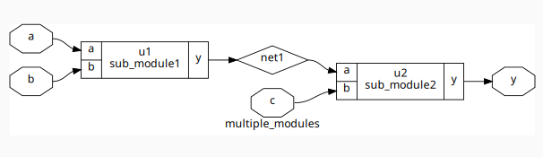
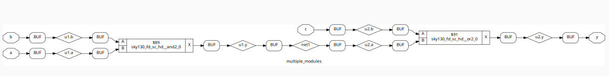
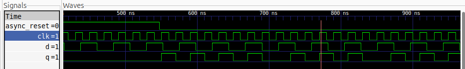
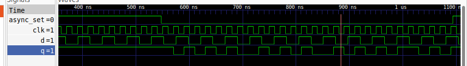
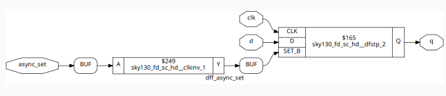
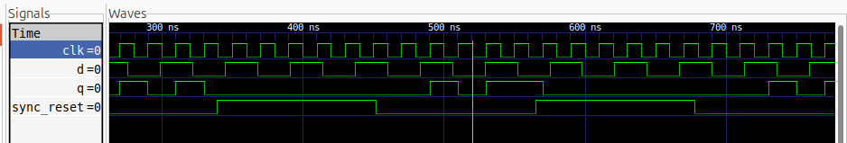
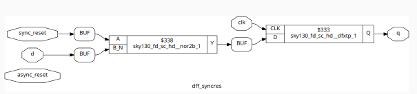
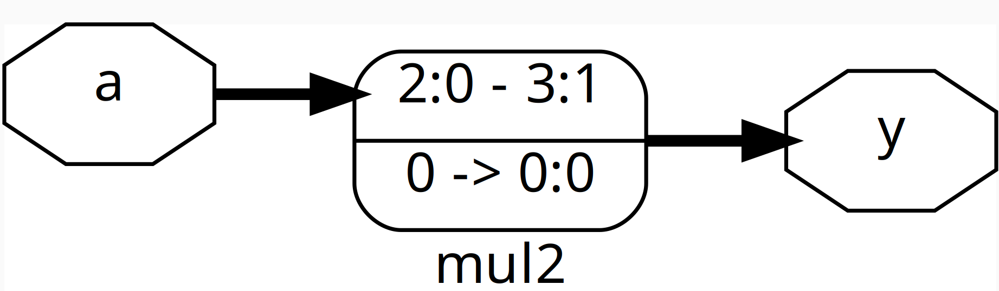

# Timing libs, hierarchical vs flat synthesis and Efficient flop coding styles

### Introduction to Timing Libraries
The Liberty format (.lib) is an industry-standard text format used to describe technology library cells such as standard cells, I/O buffers, or complex IPs.

- Timing libraries (.lib files) are critical for digital design because they:
- Contain timing, power, and area details for each standard cell
- Guide synthesis tools for accurate logic mapping and analysis.
- Model how gates and flip-flops behave under different PVT (Process, Voltage, Temperature) conditions.

In simple terms, .lib files represent the timing and power properties of cells as black boxes for use in synthesis and analysis.

### 🌡 What is PVT?
PVT defines the three main factors that influence IC behavior and timing:
- Process (P): Variations in manufacturing can make transistors faster (ff), slower (ss), or typical (tt).
- Voltage (V): Supply voltage of the chip.
    - Higher voltage → faster switching, but more power consumed.
    - Lower voltage → slower switching, but lower power use.
- Temperature (T): Impacts transistor performance.
    - Higher temperature → slower switching (resistance increases).
### Why PVT Matters?
- Ensures the chip works correctly across all operating conditions.
- Identifies best-case and worst-case timing for robust, reliable performance.


## Hierarchical vs Flat Synthesis:
- Synthesis:
      - Synthesis is the process of converting RTL (Register Transfer Level) code into a gate-level netlist.

### Hierarchical Synthesis
Hierarchical synthesis is a modular approach to converting RTL into gates. Instead of treating the design as one large block, it breaks it down into modules and synthesizes each separately.

### 🔑 Key Points
- Modular Design: Each module (like ALU, register file, controller) is synthesized on its own.
- Easier Debugging: Since modules are smaller, it’s simpler to trace issues and verify functionality.
- Reusability: Modules can be reused in multiple projects or different parts of the same design.
- Scalability: Works well for large SoCs where the design has millions of gates.
- Optimization Trade-off: May not be as tightly optimized as flat synthesis because inter-module optimizations are limited.

Example:
Hierarchical synthesis netlist for multiple_modules.v:
``` verilog
module sub_module2 (input a, input b, output y);
	assign y = a | b;
endmodule

module sub_module1 (input a, input b, output y);
	assign y = a&b;
endmodule


module multiple_modules (input a, input b, input c , output y);
	wire net1;
	sub_module1 u1(.a(a),.b(b),.y(net1));  //net1 = a&b
	sub_module2 u2(.a(net1),.b(c),.y(y));  //y = net1|c ,ie y = a&b + c;
endmodule
```


### Flattened Synthesis
Flattened synthesis is a single-block approach where the entire RTL design is merged into one large netlist before synthesis. Unlike hierarchical synthesis, it removes module boundaries to maximize optimization.

### 🔑 Key Points
- One Big Netlist: All modules are combined into a single-level design.
- Better Optimization: The tool can optimize across module boundaries (e.g., merging logic, reducing gate count, improving timing).
- Harder Debugging: Since modules are no longer separate, tracing issues back to the RTL is more complex.
- Less Reusability: Flattened modules can’t easily be reused in other projects.
- Good for Smaller Designs: Works well when the design isn’t too large or when maximum performance/area optimization is needed.

Example:
Flat synthesis netlist for multiple_modules.v:


## 🔀 Hierarchical vs. Flattened Synthesis  

| Feature        | Hierarchical 🧩              | Flattened ⚡                  |
|----------------|-----------------------------|-------------------------------|
| Structure      | Modules kept separate       | Modules merged into one netlist |
| Optimization   | Limited (within modules)    | Global (across whole design)   |
| Debugging      | Easier                      | Harder                        |
| Reusability    | High                        | Low                           |
| Best For       | Large SoCs, reusable IPs    | Small/medium designs, max optimization |

**Summary:**  
- Hierarchical → Modular, scalable, reusable.  
- Flattened → More optimized, but harder to debug/reuse.

## Flip-Flop coding styles:
### 📌 What is a Flip-Flop?
- A Flip-Flop (FF) is a sequential logic circuit that can store one bit of data (0 or 1).
- It changes its output only on a clock edge (rising or falling), which makes it different from combinational logic gates.

### 🔑 Why Do We Use Flip-Flops?
- **Data Storage:** To hold information for one clock cycle or longer.
- **Synchronization:** Ensures signals change only at clock edges for predictable timing.
- **Building Blocks:** Used to create registers, counters, shift registers, and state machines.
- **Pipeline Stages:** Essential in processors and digital systems for sequential execution.

**Below are efficient coding styles for different reset/set behaviors:**
### 📌 Asynchronous Reset D Flip-Flop:
- **Definition:** Forces the flip-flop output Q to 0 immediately, regardless of the clock.
- **Behavior:** The moment reset is active, output becomes 0 — no need to wait for a clock edge.

``` verilog
**Verilog Module:** dff_asyncres.v

module dff_asyncres (input clk, input async_reset, input d, output reg q);
  always @ (posedge clk, posedge async_reset)
    if (async_reset)
      q <= 1'b0;
    else
      q <= d;
endmodule
```
### gtkWaveform for dff_asyncres.v:

### Yosys Synthesis:


### 📌 Asynchronous Set D Flip-Flop:
- **Definition:** Forces the flip-flop output Q to 1 immediately, regardless of the clock.
- **Behavior:** As soon as set is active, output becomes 1 — independent of the clock.

```verilog
**Verilog Module:** dff_syncres.v

module dff_async_set (input clk, input async_set, input d, output reg q);
  always @ (posedge clk, posedge async_set)
    if (async_set)
      q <= 1'b1;
    else
      q <= d;
endmodule
```
### Waveform for dff_syncres.v:

### Yosys Synthesis:


### Synchronous Reset D Flip-Flop:
- **Definition:** A reset that forces the flip-flop output to 0, but only on the active clock edge.
- **Behavior:**
    - When reset = 1, output Q becomes 0 at the next clock edge.
    - When reset = 0, the flip-flop captures data input D on the clock edge.

 ``` verilog
**Verilog Module:** dff_syncres.v

module dff_syncres (input clk, input async_reset, input sync_reset, input d, output reg q);
  always @ (posedge clk)
    if (sync_reset)
      q <= 1'b0;
    else
      q <= d;
endmodule
```
### Waveform for dff_syncres.v:

### Yosys Synthesis:


## Flop Simulation and Synthesis Flow:
### iVerilog Simulation for all different reset/set behavior Flip-flops:
1. Compile the design and testbench
```
iverilog <design_file.v> <testbench_file.v>
```
2. Run the Simulation
```
./a.out
```
3. View waveform in **gtkwave**:
```
gtkwave <waveform_file.vcd>
```
### Synthesis with Yosys:
1. Start Yosys
```
yosys
```
2️. Load the Standard Cell Library
```
read_liberty -lib <path_to_sky130_fd_sc_hd__tt_025C_1v80.lib>
```
3. Read the Verilog Design File
```
read_verilog <design_file.v> 
```
4. Synthesize the Design
```
synth -top <module_name>
```
5. Technology Mapping and Netlist Generation
```
abc -liberty <path_to_sky130_fd_sc_hd__tt_025C_1v80.lib>
```
6. Mapping the flipflops
```
dfflibmap -liberty /address/to/your/sky130/file/sky130_fd_sc_hd__tt_025C_1v80.lib
```
7. Visualize the Gate-Level Netlist
```
show
```
---

## 🔧 Interesting Optimizations: Multiply by 2 and 9
In this lab, we explore basic RTL optimizations for constant multiplications, demonstrating how synthesis tools efficiently implement multiplication without requiring complex hardware.
### 1️⃣ Multiplication by 2:
**Purpose:** Multiply a 3-bit input by 2.
**Optimization Insight:**
- Multiplying by 2 does not require a full multiplier.
- The output can be generated by a left shift by 1 (append a 0 to the least significant bit).
- The synthesized netlist uses simple wiring and logic, making it efficient in both area and speed.

```verilog
**Verilog module:** mult_2.v

module mul2 (input [2:0] a, output [3:0] y );
	assign y = a*2;
endmodule
```
### Gate-level netlist for mult_2.v


### 2️⃣ Multiplication by 9
**Purpose:** Multiply a 3-bit input by 9
**Optimization Insight:**
- Multiplying by 9 can be expressed as `(input × 8) + input`
- The synthesizer implements this using a **shift and add**, instead of a full multiplier
- This approach reduces hardware usage and improves efficiency while producing the same result

```verilog
***Verilog module:*** mult_8.v
module mult8(input [2:0]a, output [5:0]y);
	assign y = a*9;
endmodule
```
### Gate-level netlist for mult_8.v

---

## Summary

- **Timing Libraries:** Provide essential data for accurate synthesis and timing closure.  
- **PVT Variations:** Ensure reliable operation across all process, voltage, and temperature conditions.  
- **Hierarchical vs Flat Synthesis:**  
  - Hierarchical → Improves reusability and debugging.  
  - Flat → Maximizes optimization across the design.  
- **Flip-Flop Coding Styles:**  
  - Efficient coding prevents glitches, reduces area, and improves performance.  
  - Use **synchronous resets** whenever possible for predictable and safe synthesis.  
  - **Asynchronous resets/sets** are used for special cases like power-on initialization or fault recovery.  
- **RTL Multiplications:**  
  - Multiply by powers of 2 → use **shift operation**, zero hardware cost.  
  - Multiply by constants like 9 → use **shift + add**, more efficient than generic multiplication.


