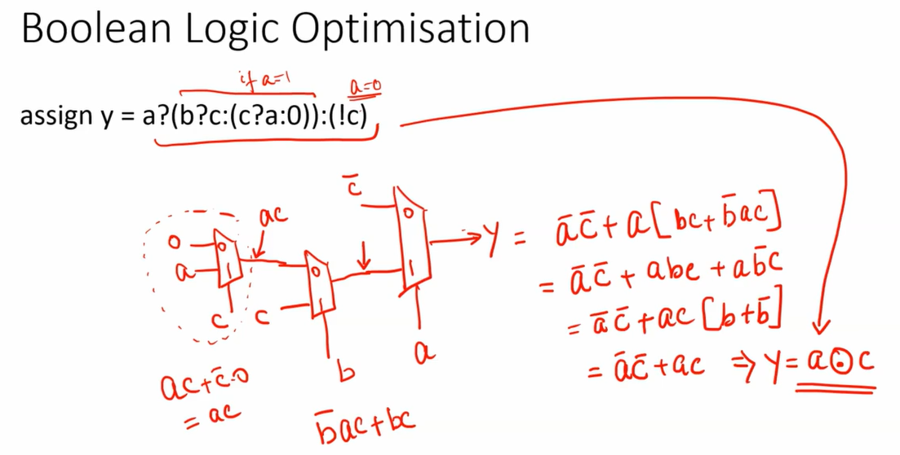

# Combinational and Sequential Optimization

## Introduction to Logic Optimizations:
## 🔹 Combinational Logic Optimization

1. **Logic Squeezing**  
   - Optimize the design to reduce **area and power**.  

2. **Constant Propagation**  
   - Replace signals with constants where possible for **direct optimization**.  

3. **Boolean Logic Optimization**  
   - Simplify logic using techniques like **K-map** or **Quine-McCluskey**.

### 🔹 Constant Propagation
**Definition:**
Constant propagation is a combinational logic optimization technique where signals or variables that have a known constant value are replaced with that constant in the logic. This simplifies the circuit and can remove unnecessary gates.

**How it Works:**
- If a signal is always 0 or 1 (or a fixed value in multi-bit logic), the synthesizer propagates this constant through the circuit.
- Any logic depending on this signal can then be simplified.

**Benefits:**
- Reduces the number of gates.
- Lowers power consumption by eliminating unnecessary transitions.
- Shortens the critical path, improving timing.
- Makes the design easier to debug and analyze.


### 🔹 Boolean Logic Optimization

**Definition:**  
Boolean logic optimization is the process of **simplifying logic expressions** using Boolean algebra so that a digital circuit uses **fewer gates**, reduces **area**, and improves **speed**, without changing its functional behavior.

**Why It Matters:**  
- Reduces **hardware resources** and silicon area.  
- Shortens **critical paths**, improving circuit speed.  
- Lowers **power consumption** by reducing gate count.  
- Simplifies **routing** in the physical design.



### 🔹 Sequential Logic Optimization
**Definition:**
 - Identify registers or sequential signals that hold **constant values**.
 - Propagate these constants through the logic to simplify the design.
 - Unlike combinational constant propagation, this technique considers the effect of flip-flops and state elements over time, not just within a single combinational path.

**How It Works:**
- If a register or sequential output is known to be constant for all possible inputs at a given state or time, the synthesizer can:
    - Replace the signal with a constant value in dependent logic.
    - Simplify combinational logic that follows the register.
- Can also detect redundant registers that do not affect the final output.

**Benefits:**
- Reduces hardware resources by removing unnecessary gates and registers.
- Improves timing by shortening critical paths.
- Lowers power consumption by reducing switching activity.
- Helps the synthesis tool generate more efficient sequential designs.

### 🔹 State Optimization
**Definition:**  
State optimization is the process of **reducing the number of states** in a finite state machine (FSM) without changing its external behavior. This makes the FSM **smaller, faster, and more power-efficient**.

**Why It Matters:**  
- Fewer states → less hardware (smaller registers and logic).  
- Simplifies **state transition logic**, improving timing.  
- Reduces **power consumption** by minimizing switching activity.  
- Makes the design **easier to understand, verify, and maintain**.

### 🔹 Cloning
**Definition:**  
Cloning is a technique in **logic synthesis** where multiple copies of a logic block or module are created to **reduce fan-out and improve timing**.  

**Why It Matters:**  
- High fan-out signals can **slow down the circuit**.  
- Cloning distributes the load using **additional drivers**, reducing delay.  
- Helps meet **timing constraints** in critical paths.  
- Improves **overall circuit performance** without changing functionality.  

**How It Works:**  
1. Identify signals with **high fan-out**.  
2. Create **duplicate logic blocks or buffers** to drive subsets of the load.  
3. Connect the outputs of these cloned blocks to the original destinations. 

### 🔹 Retiming
**Definition:**  
Retiming is a **sequential optimization technique** where flip-flops (registers) are repositioned across combinational logic to **improve timing, reduce critical path delay, or meet clock constraints** without changing the circuit's functionality.

**Why It Matters:**  
- Reduces **critical path delay** by balancing combinational paths.  
- Improves **maximum clock frequency**.  
- Maintains **functional correctness**.  
- Helps in **pipelining** for high-performance designs.

**How It Works:**  
1. Analyze combinational paths between registers.  
2. Move registers **forward or backward** across logic gates to balance delays.  
3. Ensure **data dependencies** are preserved.

## Labs on Combination & Sequential Logic Optimizations:
## Steps to synthesis the design:
1.  Start Yosys
```
yosys
```
2️. Load the Standard Cell Library
```
read_liberty -lib <path_to_sky130_fd_sc_hd__tt_025C_1v80.lib>
```
3. Read the Verilog Design File
```
read_verilog <design_file.v> 
```
4. Synthesize the Design
```
synth -top <module_name>
```
5. opt
```
opt_clean -purge
```
6. Technology Mapping and Netlist Generation
```
abc -liberty <path_to_sky130_fd_sc_hd__tt_025C_1v80.lib>
```
7. Visualize the Gate-Level Netlist
```
show
```
---
## 1. Lab1- 2 input AND gate
```verilog
🔹 Module: opt_check
module opt_check (input a , input b , output y);
	assign y = a?b:0;
endmodule
```
**Functionality:**  
- Behavior: `y = a ? b : 0`  
  - If `a = 1`, `y` takes the value of `b`  
  - If `a = 0`, `y = 0`  
- Equivalent Logic: `y = a & b`  


## 2. Lab2 - 2 input OR gate
```verilog
🔹 Module: opt_check2
module opt_check2 (input a , input b , output y);
	assign y = a?1:b;
endmodule
```

**Functionality:**  
- Acts as a multiplexer:
   - y = 1 if a is true.
   - y = b if a is false.
- Equivalent Logic: Can be thought of as `y = a | b`.


## 3. Lab3 - 3 input AND gate
```verilog
🔹 Module: opt_check3
module opt_check2 (input a , input b , output y);
	assign y = a?1:b;
endmodule
```
**Functionality:**
- This is equivalent to a 2-to-1 multiplexer:
   - If a = 1 → select input 1 → output y = 1
   - If a = 0 → select input 0 → output y = b

## 4. Lab4:
```verilog
🔹 Module: opt_check4
module opt_check4 (input a , input b , input c , output y);
 assign y = a?(b?(a & c ):c):(!c);
 endmodule
```
**Functionality:**  
- **Inputs:** `a`, `b`, `c` | **Output:** `y`  
- **Behavior (nested ternary operators):**  
  - If `a = 1`:  
    - If `b = 1`: `y = a & c` → since `a = 1`, `y = c`  
    - If `b = 0`: `y = c`  
  - If `a = 0`: `y = !c`  
- **Simplified Expression:**  y = (a ? c : !c);

## 5. Lab5 - D Flip Flop:
```verilog
🔹 Module: dff_const1
module dff_const1(input clk, input reset, output reg q);
always @(posedge clk, posedge reset)
begin
	if(reset)
		q <= 1'b0;
	else
		q <= 1'b1;
end
endmodule
```
**Functionality:**  
- D Flip-flop with **asynchronous reset**: output `q` is cleared to 0 immediately when `reset` is high.  
- When `reset` is low, the flip-flop **always outputs 1** on every clock edge.  
- Effectively produces a **constant logic high** after reset.

## 6. Lab6 - d Flip Flop
```verilog
🔹 Module: dff_const2
module dff_const2(input clk, input reset, output reg q);
always @(posedge clk, posedge reset)
begin
	if(reset)
		q <= 1'b1;
	else
		q <= 1'b1;
end
endmodule
```
**Functionality:**  
- D Flip-Flop with **asynchronous reset**.  
- On reset → output `q` is set to `1`.  
- On every clock edge (when not in reset) → `q` remains `1`.

## 7. Lab7
```verilog
🔹 Module: dff_const3
module dff_const3(input clk, input reset, output reg q);
reg q1;
always @(posedge clk, posedge reset)
begin
   if(reset)
   begin
      q1 <=1'b1;
      q1 <=1'b0;
   end
   else
   begin
      q1 <=1'b1;
      q <=q1;
   end
end
endmodule
```
**Functionality:**  
- On reset → `q1` is first set to `1` and then immediately to `0`.  
  (Final effect: `q1 = 0` because the last assignment wins).  
- On every clock edge (when not in reset):  
  - `q1` is forced to `1`.  
  - `q` takes the value of the previous `q1`.
 
  


