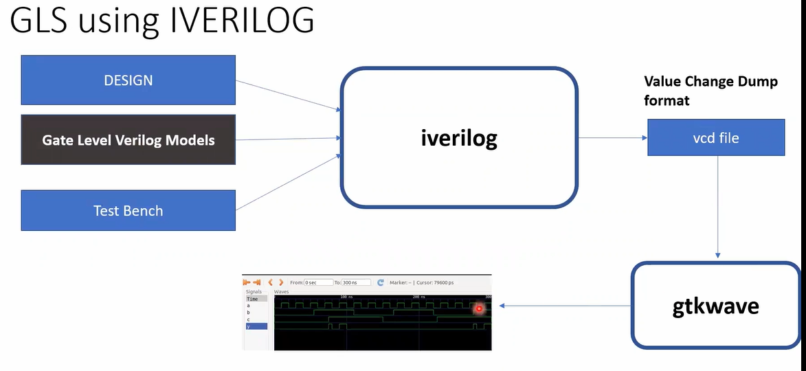
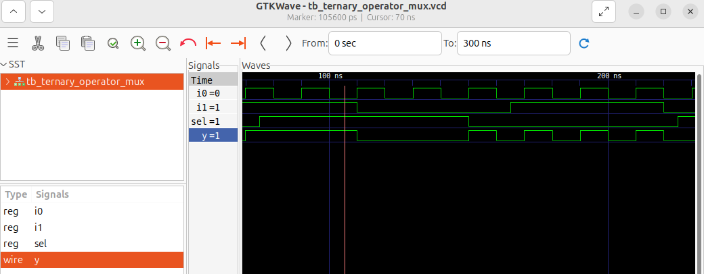
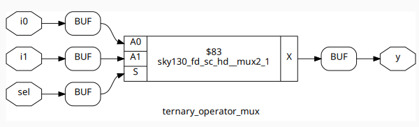
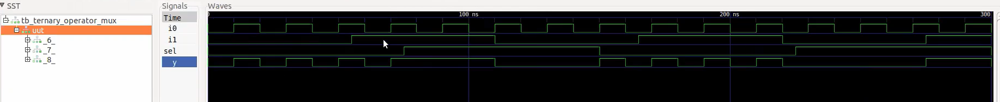
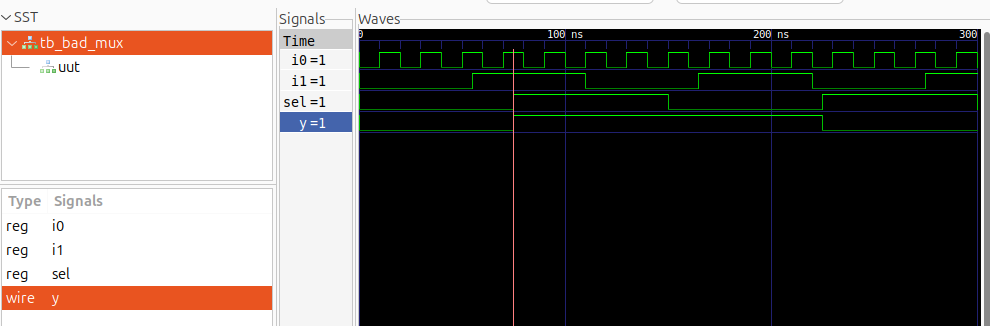
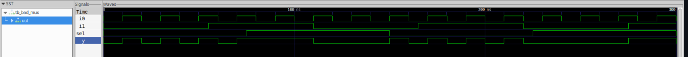
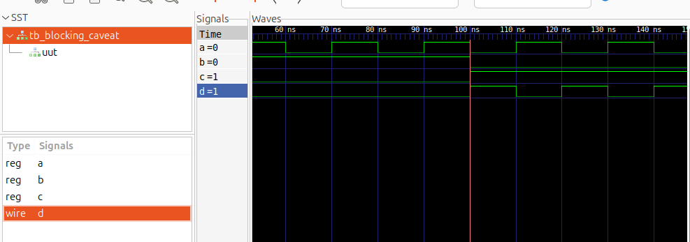
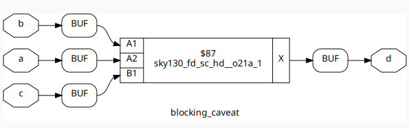
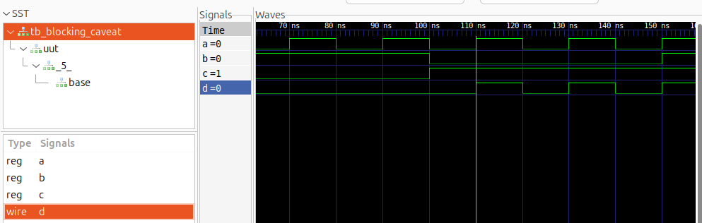

# Day 4 - Gate-Level Simulation (GLS), Blocking vs. Non-Blocking, and Synthesis-Simulation Mismatch

Today we’ll dive into three key concepts in digital design:  

- **Gate-Level Simulation (GLS)**  
- **Blocking vs. Non-Blocking Assignments in Verilog**  
- **Synthesis vs. Simulation Mismatches**  

We’ll cover both the theoretical background and practical impact, followed by hands-on labs to strengthen your learning.  

---

## 1. Gate-Level Simulation (GLS):
**Definition:**  
- GLS simulates the synthesized gate-level netlist (post-synthesis Verilog) including gates, flip-flops, and optionally timing delays.
- Running the test bench with Netlist as Design Under Test.
- Netlist is logically same as RTL code.


### **Why GLS:**  
- Verifies that the synthesized netlist matches RTL functionality.  
- Detects synthesis-simulation mismatches like uninitialized flops or logic differences.  
- Validates timing behavior with SDF back-annotation.  
- Acts as a final verification step before tapeout to ensure correct silicon behavior.

### Types of GLS:
**Functional GLS:**
- Logic-only simulation, ignores actual gate delays.
- Used to verify correct functionality of the synthesized netlist.
**Timing GLS:**
- Uses SDF (Standard Delay Format) annotated delays for gates and flip-flops.
- Verifies real-world timing behavior, such as setup/hold violations.



## 2. Synthesis-Simulation Mismatch:
**Definition:**  
Synthesis-Simulation Mismatch occurs when the behavior of the synthesized gate-level netlist differs from the original RTL simulation. In other words, the circuit behaves differently after synthesis than what was expected in RTL verification.

**Causes:**  
- **Incorrect coding styles:** Improper use of blocking/non-blocking assignments, incomplete sensitivity lists.  
- **Uninitialized signals or registers:** RTL simulation may assume default values (X → 0), while synthesis implements differently.  
- **Unsupported constructs by synthesis tool:** Certain RTL patterns may be interpreted differently in synthesis.  
- **Asynchronous resets/sets or inferred latches:** Can lead to mismatches between RTL and gate-level behavior.  
- **Optimization effects:** Synthesis may remove “redundant” logic that was relied upon in RTL.

## 3.Blocking vs. Non-Blocking Assignments in Verilog:
## 1️⃣ Blocking Assignments (=):
**Definition:**  
- Executed sequentially in the order written inside an `always` block.
- The next statement waits until the current assignment completes.

**Usage:**  
Typically used for combinational logic.

**Example:**  
```verilog
always @(*) begin
    a = b;  // blocking
    c = a;  // executes after a = b
end
```
## 2️⃣ Non-Blocking Assignments (<=)
**Definition:**
- Executed concurrently at the end of the time step.
- The right-hand side values are sampled immediately, but the left-hand side updates after all RHS are evaluated.

**Usage:**
Typically used for sequential logic (flip-flops, registers).

**Example:**
``` verilog
always @(posedge clk) begin
    a <= b;  // non-blocking
    c <= a;  // uses old value of a
end
```

## 4. Labs:
## i. Ternary Operator MUX:
Verilog code for a simple 2:1 multiplexer using a ternary operator:

``` verilog
module ternary_operator_mux (input i0, input i1, input sel, output y);
  assign y = sel ? i1 : i0;
endmodule
```
**Functionality:** The module implements a 2-to-1 multiplexer where y outputs i1 if sel is 1, else outputs i0.


## ii. Synthesis using Yosys:
Synthesize the above MUX using Yosys by following the standard synthesis flow.


## iii. Gate-Level Simulation (GLS) of MUX
Run the GLS for the synthesized MUX by using the below command

```
iverilog /path/to/primitives.v /path/to/sky130_fd_sc_hd.v ternary_operator_mux.v testbench.v
```


### iv. Bad MUX Example 


### v. GLS of Bad MUX
Run the GLS on the bad_mux.


### vi. Blocking Assignment Caveat:
Verilog code:
```verilog
module blocking_caveat (input a, input b, input c, output reg d);
  reg x;
  always @ (*) begin
    d = x & c;
    x = a | b;
  end
endmodule
```
**Issue:**
- We are using blocking assignment (=) inside a combinational always block.
- In line (1), d is assigned using the old value of x because x is updated only afterward in line (2).
- This may not match intended logic and can cause simulation vs synthesis mismatches.

**Correct Version:**
```verilog
always @(*) begin
  x = a | b;
  d = x & c;
end
```


### vii. Synthesis of the Blocking Caveat Module:


**GLS of Blocking Caveat**


## 📝 Summary:
- **Gate-Level Simulation (GLS):** Ensures the post-synthesis netlist works correctly, with accurate timing and test features.  
- **Synthesis-Simulation Mismatch (SSM):** Prevent mismatches by writing clean, synthesizable RTL.  
- **Blocking vs. Non-Blocking:** Use `=` for combinational logic and `<=` for sequential (flip-flop) logic.  
- **Labs:** Practical exercises to strengthen concepts and expose common coding mistakes.  
