# Day 5: Optimization in Synthesis
- In this session, we dive into optimization techniques in Verilog synthesis.  
- Topics include the impact of **if-else statements**, **for loops**, and **generate blocks**, along with common pitfalls like **inferred latches**.  
- Hands-on labs are provided to reinforce concepts through practical coding examples.

## 1. If-Else Statements in Verilog
**Definition:**
if-else statements are conditional constructs used in Verilog to make decisions based on input values. They allow different blocks of code to execute depending on whether a condition is true or false.
**Behavior:**
- if → Executes when the condition is true.
- else if → Checks the next condition if the previous one was false.
- else → Executes when none of the above conditions are true.

**Syntax**
```verilog
if (condition) begin
   // statements executed if condition is true
end
else begin
   // statements executed if condition is false
end
```
** Nested If-Else Syntax:**
```verilog
if (condition1) begin
   // executes if condition1 is true
end
else if (condition2) begin
   // executes if condition1 is false AND condition2 is true
end
else if (condition3) begin
   // executes if previous conditions are false AND condition3 is true
end
else begin
   // executes if none of the conditions are true
end
```
## 2.Inferred Latches in Verilog
- An inferred latch is unintentionally created during synthesis when a combinational always block does not assign values to an output under all possible conditions.
- The synthesis tool inserts a latch to "remember" the previous value whenever the signal is not explicitly updated.
- This is usually undesired, because latches can cause timing issues and unpredictability in hardware.

### Example of Inferred Latch:
```verilog
module inferred_latch_if (
  input  a,
  input  b,
  output reg y
);
always @(*) begin
  if (a)
    y = b; // Missing else -> when a=0, y is not assigned -> latch inferred
end
endmodule
```
**Problem:**
- When a = 1, y gets assigned b.
- But when a = 0, no assignment happens.
- Synthesizer assumes y must hold its old value → latch inferred.

**Solution 1:** Add an else
```verilog
always @(*) begin
  if (a)
    y = b;
  else
    y = 1'b0;   //  y always gets a value
end
```

**Solution 2:** Default Assignment
```verilog
always @(*) begin
  y = 1'b0;     // default assignment
  if (a)
    y = b;
end
```

## 3. Labs for If-Else and Case Statements
### Lab 1: Incomplete If Statement
```verilog
module incomp_if (input i0, input i1, input i2, output reg y);
always @(*) begin
    if (i0)
        y <= i1;
end
endmodule
```
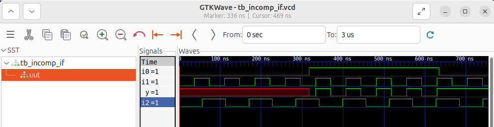

### Lab 2: Yosys Synthesis Result of Lab 1
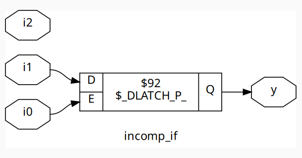

### Lab3: Nested If-Else
```verilog
module incomp_if2 (input i0, input i1, input i2, input i3, output reg y);
always @(*) begin
    if (i0)
        y <= i1;
    else if (i2)
        y <= i3;
end
endmodule
```
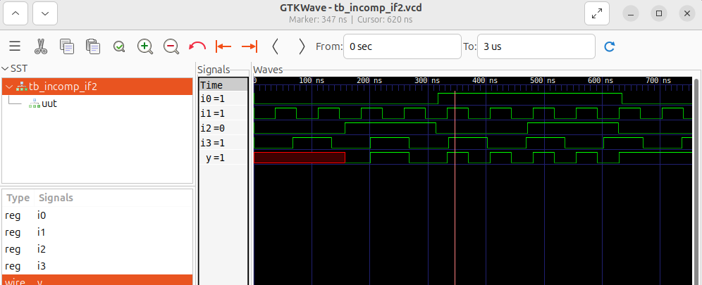

### Lab4: Yosys Synthesis Result of Lab 3
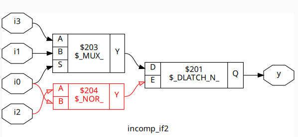

### Lab 5: Complete Case Statement
```verilog
module comp_case (input i0, input i1, input i2, input [1:0] sel, output reg y);
always @(*) begin
    case(sel)
        2'b00 : y = i0;
        2'b01 : y = i1;
        default : y = i2;
    endcase
end
endmodule
```
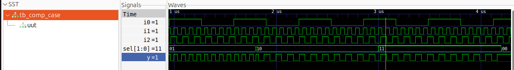


### Lab 6: Synthesis Result of Lab 5
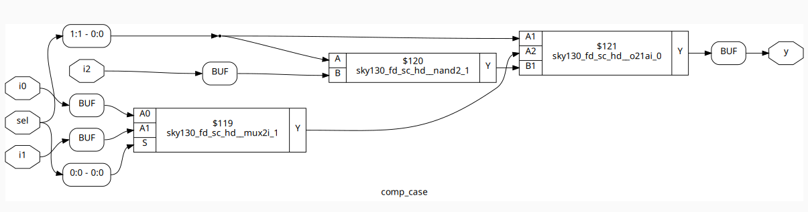

### Lab 7: Incomplete Case Handling
```verilog
module bad_case (
    input i0, input i1, input i2, input i3,
    input [1:0] sel,
    output reg y
);
always @(*) begin
    case(sel)
        2'b00: y = i0;
        2'b01: y = i1;
        2'b10: y = i2;
        2'b1?: y = i3; // '?' is a wildcard; be careful with incomplete cases!
    endcase
end
endmodule
```
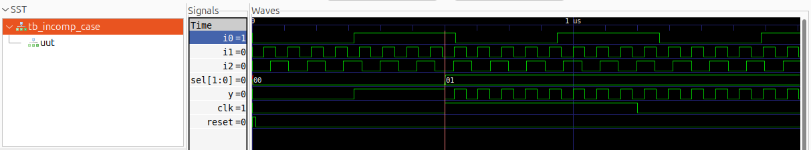

### Lab 8: Yosys Synthesis:
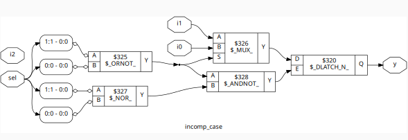

### Lab 9: Partial Assignments in Case
```verilog
module partial_case_assign (
    input i0, input i1, input i2,
    input [1:0] sel,
    output reg y, output reg x
);
always @(*) begin
    case(sel)
        2'b00: begin
            y = i0;
            x = i2;
        end
        2'b01: y = i1;
        default: begin
            x = i1;
            y = i2;
        end
    endcase
end
endmodule
```
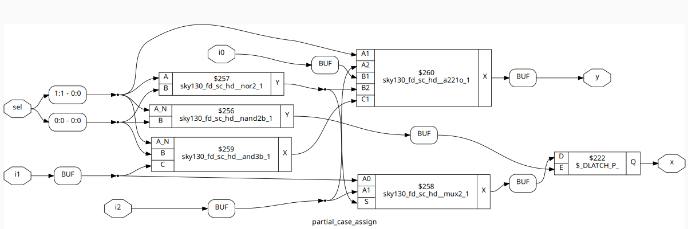

## 4. For Loops in Verilog
- A for loop is used inside procedural blocks (initial, always, task, function) to execute statements repeatedly based on a loop counter.
- Unlike software loops, Verilog loops do not run dynamically at runtime – instead, they are unrolled during synthesis (like copy-pasting code multiple times).
### Usage
- In Procedural Blocks (always, initial)
     - Useful for writing repetitive assignments.
- In Generate Blocks (for structural replication)
   - Useful to replicate hardware modules.
### Syntax:
``` verilog
for (initialization; condition; increment) begin
    // Statements to execute
end
```
**Example:** 2x1 MUX Using For Loop
```verilog
module mux2to1_for (
  input  [1:0] d,   // two data inputs
  input  sel,       // select line
  output reg y      // output
);

  integer i;
  always @(*) begin
    y = 0;
    for (i = 0; i < 2; i = i + 1) begin
      if (sel == i)
        y = d[i];
    end
  end
endmodule
```

## 5. Generate Blocks in Verilog
**Definition:**
- A generate block in Verilog is used to replicate or conditionally instantiate hardware during elaboration (before simulation/synthesis).
- It is very useful for repetitive structures (like arrays of gates, multiplexers, adders, etc.) and parameterized designs.
- Typically used with for loops and the genvar keyword.

**Why Use Generate?**
- Avoids writing repetitive code.
- Helps create scalable and parameterized hardware.
- Supports conditional hardware generation (if-generate) and loop-based generation (for-generate).

**Syntax:**
1. For-Generate Loop
```verilog
genvar i;
generate
  for (i = 0; i < N; i = i + 1) begin : block_name
    // Instantiate module or logic N times
  end
endgenerate
```

2️. If-Generate
```verilog
generate
  if (condition) begin
    // hardware option 1
  end else begin
    // hardware option 2
  end
endgenerate
```

## 6. Ripple Carry Adder (RCA):
**Definition:** 
- A Ripple Carry Adder (RCA) is a digital circuit used to add two multi-bit binary numbers.
- It is built by cascading multiple full adders, where the carry output from each stage is passed to the next stage.

**Working Principle:**
- Each full adder adds a pair of bits (ai and bi) along with a carry-in (ci).
- The carry-out from one stage becomes the carry-in of the next stage.
- Since the carry signal “ripples” through all the stages, it is called a Ripple Carry Adder.

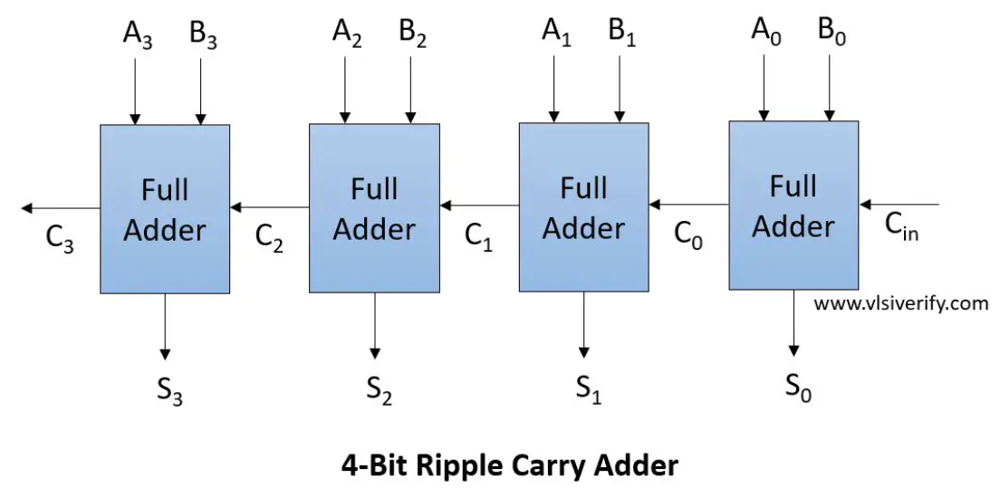

## 7. Labs on Loops and Generate Blocks
**Lab 10:  4x1 MUX Using For Loop**

```verilog
module mux_generate (
    input i0, input i1, input i2, input i3,
    input [1:0] sel,
    output reg y
);
wire [3:0] i_int;
assign i_int = {i3, i2, i1, i0};
integer k;
always @(*) begin
    for (k = 0; k < 4; k = k + 1) begin
        if (k == sel)
            y = i_int[k];
    end
end
endmodule
```
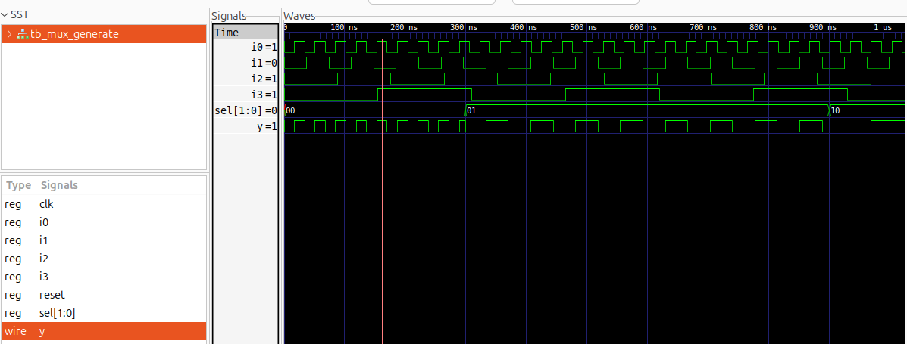

**Lab 11: 8x1 Demux Using Case**
```verilog
module demux_case (
    output o0, output o1, output o2, output o3,
    output o4, output o5, output o6, output o7,
    input [2:0] sel,
    input i
);
reg [7:0] y_int;
assign {o7, o6, o5, o4, o3, o2, o1, o0} = y_int;
always @(*) begin
    y_int = 8'b0;
    case(sel)
        3'b000 : y_int[0] = i;
        3'b001 : y_int[1] = i;
        3'b010 : y_int[2] = i;
        3'b011 : y_int[3] = i;
        3'b100 : y_int[4] = i;
        3'b101 : y_int[5] = i;
        3'b110 : y_int[6] = i;
        3'b111 : y_int[7] = i;
    endcase
end
endmodule
```
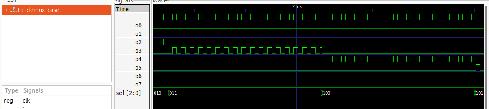

### Lab 12: 8-to-1 Demux Using For Loop

```verilog
module demux_generate (
    output o0, output o1, output o2, output o3,
    output o4, output o5, output o6, output o7,
    input [2:0] sel,
    input i
);
reg [7:0] y_int;
assign {o7, o6, o5, o4, o3, o2, o1, o0} = y_int;
integer k;
always @(*) begin
    y_int = 8'b0;
    for (k = 0; k < 8; k = k + 1) begin
        if (k == sel)
            y_int[k] = i;
    end
end
endmodule
```
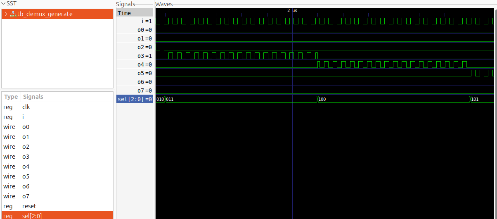

### Lab 13: 8-bit Ripple Carry Adder with Generate Block
```verilog
module rca (
    input [7:0] num1,
    input [7:0] num2,
    output [8:0] sum
);
wire [7:0] int_sum;
wire [7:0] int_co;

genvar i;
generate
    for (i = 1; i < 8; i = i + 1) begin
        fa u_fa_1 (.a(num1[i]), .b(num2[i]), .c(int_co[i-1]), .co(int_co[i]), .sum(int_sum[i]));
    end
endgenerate

fa u_fa_0 (.a(num1[0]), .b(num2[0]), .c(1'b0), .co(int_co[0]), .sum(int_sum[0]));

assign sum[7:0] = int_sum;
assign sum[8] = int_co[7];
endmodule
```
### Full Adder Module:
```verilog
module fa (input a, input b, input c, output co, output sum);
    assign {co, sum} = a + b + c;
endmodule
```
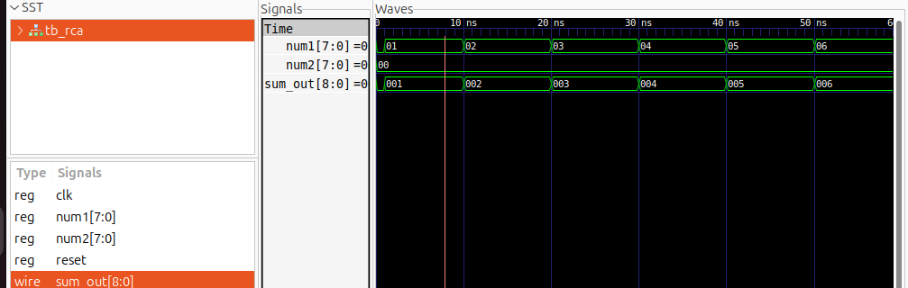


## Summary:
- **If-Else Statements** – Used for conditional decision-making; must cover all cases to avoid unintended latches.
- **Inferred Latches** – Occur when outputs in combinational blocks aren’t assigned for all input conditions; fixed with else/default assignments.
- **Case Statements** – Provide multi-way branching; incomplete cases can also infer latches, so include a default.
- **For Loops** – Used in procedural blocks for repetitive logic; unrolled during synthesis, not runtime.
- **Generate Blocks** – Enable structural replication or conditional hardware instantiation at elaboration.
- **Ripple Carry Adder (RCA)** – A chain of full adders where carry ripples through stages; simple but slow for wide adders.
- **Labs** – Practical exercises showing how incomplete conditions, loops, and generate blocks impact synthesized hardware.
